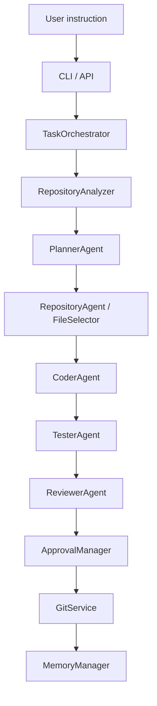

# Kodiak Architecture

## Current scope

Kodiak v1 is an early-stage local agentic coding workflow. It provides repository analysis,
deterministic planning and file selection, a bounded set of safe edit templates, local tests and
linting, Git diff review, approval-gated actions, and sanitized local history. It does not claim to
implement arbitrary software tasks or operate as an unattended AI engineer.

## Runnable v1 pipeline



The CLI and `POST /tasks/run` use the same `TaskOrchestrator`. API task runs always use
`no_commit=True`. The local v1 workflow never pushes to a remote.

## Components

| Component | Current v1 responsibility |
|---|---|
| CLI / API | Validate user-facing input, call services, and render or serialize results. |
| `TaskOrchestrator` | Coordinate the complete local workflow and return a typed `TaskRunResult`. |
| `RepositoryAnalyzer` | Validate the repository, inventory files, identify project signals, and inspect Git state. |
| `PlannerAgent` | Classify supported tasks and produce a typed deterministic plan. |
| `RepositoryAgent / FileSelector` | Rank repository-relative files relevant to the instruction. |
| `CoderAgent` | Apply only known templates and refuse writes outside the selected repository. |
| `TesterAgent` | Run pytest and Ruff with argument lists, a repository `cwd`, `shell=False`, and timeouts. |
| `ReviewerAgent` | Summarize changes, checks, risk, Git diff information, and next actions. |
| `ApprovalManager` | Persist pending decisions and enforce approval policy for risky actions. |
| `GitService` | Perform read-only inspection and explicitly executed, approved local commits. |
| `MemoryManager` | Store sanitized JSONL history and per-run JSON under `.kodiak/`. |

## Supported deterministic tasks

- Improve a README quickstart without duplicating Kodiak's marker.
- Add or improve the known FastAPI health endpoint test.
- Add a basic package unit test.
- Add a missing `__init__.py` package marker.
- Add an explicit missing import to a named Python file when the instruction is unambiguous.
- Generate a bounded `PROJECT_STRUCTURE.md` file listing repository-relative paths.
- Generate concise CLI help documentation.

Other instructions produce a plan with `manual_required`; they do not fabricate an edit.

## Approval and Git safety

Risky plans stop before editing. Successful changes run with commit disabled unless the caller
explicitly requests the standard flow, which creates a `git_commit` approval instead of committing.
`approval approve` records consent only. `approval execute` is a separate explicit step that:

1. Requires an approved `git_commit` request.
2. Confirms the approval belongs to the selected repository.
3. Revalidates every approved file against its recorded SHA-256 hash.
4. Rejects unrelated staged files.
5. Stages only the approved repository-relative paths and creates a local commit.

There is no v1 push implementation. Destructive reset, clean, checkout, branch deletion, and force
push are not used by this local workflow.

## Local state

```text
.kodiak/
|-- approvals.json
|-- task_history.jsonl
|-- memory.jsonl
|-- pytest_cache/
`-- runs/
    `-- <task_id>.json
```

History stores check status summaries, not subprocess stdout/stderr. Provider key diagnostics store
and display only `present` or `missing`.

## API boundary

The FastAPI application exposes `/health`, `/agents`, `/tasks/run`, `/tasks/{task_id}`,
`/approvals`, approval decision routes, and `/memory/history`. Repository paths are constrained to
the server workspace. The API is a local interface; authentication, multi-user authorization, and
remote deployment hardening remain outside the v1 scope.

## Experimental packages

The repository contains broader orchestration, LLM, RAG, sandbox, worker, and GitHub modules with
their own tests. They are not all connected to the runnable local workflow described above and are
not required for offline v1 operation.
