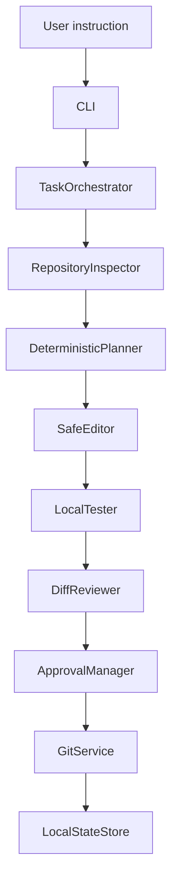

# Kodiak Architecture

## Current scope

Kodiak v1 is an early-stage local agentic coding workflow. It provides repository analysis,
deterministic planning and file selection, a bounded set of safe edit templates, local tests and
linting, Git diff review, approval-gated actions, and sanitized local history. It does not claim to
implement arbitrary software tasks or operate as an unattended AI engineer.

## Runnable v1 pipeline



The CLI uses `TaskOrchestrator`. The database-backed task API is separate and experimental; it does
not currently expose this local file-editing workflow. The local v1 workflow never pushes to a
remote.

## Components

| Component | Current v1 responsibility |
|---|---|
| CLI | Validate user-facing input, call services, and render or serialize results. |
| `TaskOrchestrator` | Coordinate the complete local workflow and return a typed `TaskRunResult`. |
| `RepositoryAnalyzer` | Validate the repository, inventory files, identify project signals, and inspect Git state. |
| `DeterministicPlanner` | Classify supported tasks and produce a typed deterministic plan. |
| `SafeEditor` | Apply only known templates and refuse writes outside the selected repository. |
| `LocalTester` | Run pytest and Ruff with argument lists, a repository `cwd`, `shell=False`, and timeouts. |
| `DiffReviewer` | Summarize changes, checks, and Git diff information. |
| `ApprovalManager` | Persist pending decisions and enforce approval policy for risky actions. |
| `GitService` | Perform read-only inspection and explicitly executed, approved local commits. |
| `MemoryManager` | Store sanitized JSONL history and per-run JSON under `.kodiak/`. |

## Supported deterministic tasks

- Improve a README quickstart without duplicating Kodiak's marker.
- Add or improve the known FastAPI health endpoint test.

Other instructions produce a plan with `manual_required`; they do not fabricate an edit.

## Approval and Git safety

Risky plans stop before editing. Successful changes run with commit disabled when `--no-commit` is
used. Standard mode records a `git_commit` approval instead of committing. `approval approve` and
`approval reject` record decisions only; v1 does not expose commit execution or task resumption.
There is no v1 push implementation. Destructive reset, clean, checkout, branch deletion, and force
push are not used by this local workflow.

## Local state

```text
.kodiak/
|-- approvals.json
|-- task_history.jsonl
|-- memory.jsonl
|-- pytest_cache/
`-- runs/
    `-- <task_id>.json
```

History stores check status summaries, not subprocess stdout/stderr. Provider key diagnostics store
and display only `present` or `missing`.

## API boundary

The FastAPI application exposes `/health`, `/agents`, `/approvals`, approval decision routes, and
`/memory/history`, along with experimental database-backed project/task routes. The API does not
currently run the local `TaskOrchestrator`. Authentication, multi-user authorization, and remote
deployment hardening remain outside the local v1 scope.

## Experimental packages

The repository contains broader orchestration, LLM, RAG, sandbox, worker, and GitHub modules with
their own tests. They are not all connected to the runnable local workflow described above and are
not required for offline v1 operation.
