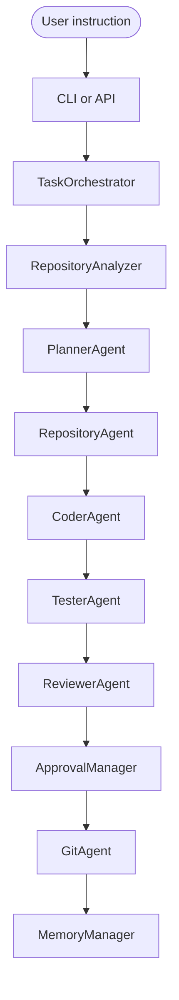
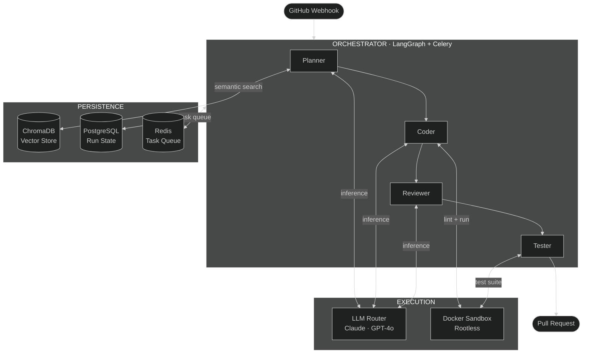

<div align="center">

<picture>
  <source media="(prefers-color-scheme: dark)" srcset="images/kodiaklogo.png">
  
</picture>

<br/><br/>

# kodiak

**Early-stage, approval-gated software-engineering framework.**<br/>
Local repository analysis, deterministic planning, safe edits, checks, review, and task history.

<br/>

[](https://python.org)
[](https://fastapi.tiangolo.com)
[](LICENSE)

<br/>

[Overview](#overview) &nbsp;&middot;&nbsp;
[Quickstart](#quickstart) &nbsp;&middot;&nbsp;
[Architecture](#architecture) &nbsp;&middot;&nbsp;
[Stack](#stack) &nbsp;&middot;&nbsp;
[Development](#development) &nbsp;&middot;&nbsp;
[Docs](ARCHITECTURE.md)

<br/>

</div>

---

## Overview

Kodiak is an open-source AI software engineering framework that uses specialized agents to analyze repositories, plan code changes, apply safe edits, run tests, review diffs, and manage task memory. It is designed to turn high-level software tasks into safer, test-backed code changes with explicit approval gates for risky operations.

**Current status:** Kodiak v1 is an early-stage local agentic coding workflow. It currently focuses on repository analysis, deterministic planning, safe task execution, testing, review, and approval-gated changes.

The local workflow works without an LLM key and deliberately handles only known, bounded edit templates. Unsupported work produces a plan and a `manual_required` result instead of fabricated code. Review every generated change before accepting it.

<br/>

<table>
<tr>
<td align="center" width="33%">
<strong>Approval gated</strong><br/><br/>
Potentially dangerous local and remote actions are subject to permission and approval policy.
</td>
<td align="center" width="33%">
<strong>Codebase-Aware</strong><br/><br/>
Deterministic filesystem search identifies candidate files before a supported local edit.
</td>
<td align="center" width="33%">
<strong>Self-Validating</strong><br/><br/>
Runs pytest and Ruff locally, captures results, and reports failures without hiding them.
</td>
</tr>
</table>

---

## Current v1 features

- Repository context discovery and keyword-based file selection
- Structured deterministic plans for bounded task types
- Safe templates for health tests, README quickstarts, package markers, basic unit tests,
  explicit imports, and CLI documentation
- pytest and Ruff execution with captured output and graceful missing-tool handling
- Review reports, local JSONL task history, and per-run JSON records
- File-backed approval requests for sensitive changes and local commits
- Shared `TaskOrchestrator` service for the CLI and API
- Explicit approved-commit execution with file-hash and staged-file revalidation
- Deterministic project-structure summaries

The advanced agents, RAG, workers, databases, and GitHub modules elsewhere in this repository remain
experimental and are not all connected to the local v1 path.

---

## Demo

The runnable local workflow is:

```
kodiak task run "Add a simple health check test" --path . --no-commit

repository -> plan -> select files -> safe edit -> pytest/Ruff -> review -> local history
```

---

## Quickstart

<!-- kodiak-v1-quickstart -->

**Prerequisites:** Python 3.12 and Git. Docker is needed only for infrastructure features.

**1 &mdash; Install**

```bash
git clone <your-kodiak-repository-url>
cd kodiak
python -m venv .venv
# PowerShell: .\.venv\Scripts\Activate.ps1
# POSIX: source .venv/bin/activate
python -m pip install -e ".[dev]"
```

**2 &mdash; Verify the CLI**

```bash
kodiak --help
kodiak version
```

CLI help and read-only repository analysis do not require provider or GitHub credentials.

**3 &mdash; Run the local workflow**

```powershell
.\.venv\Scripts\Activate.ps1
kodiak analyze analyze . --deep
kodiak task run "Add a simple health check test" --path . --dry-run
```

Run the optional local API with `uvicorn kodiak.api.main:app --reload`, then open `/docs`. Docker and
external services are not required for the local CLI workflow or these local API routes.

Useful commands:

```powershell
kodiak task --help
kodiak agents list
kodiak approval list
kodiak memory history
kodiak git diff-summary
kodiak doctor
python -m pytest -ra -vv --tb=short
ruff check .
```

Runtime state is written beneath the selected repository in `.kodiak/`. No provider key is required.
Kodiak never pushes or force-resets. Sensitive planned edits stop before mutation. Approval records
consent but does not execute or commit an action automatically.

## Safety and Approvals

Kodiak v1 stores approval requests locally in `.kodiak/approvals.json`. Git commits, deletions,
changes spanning more than five files, dependency and lock-file edits, CI/CD workflows,
authentication or security code, database migrations, risky shell commands, and every remote push
require explicit approval. Remote push is disabled in v1 even when an approval exists.

Approving or rejecting updates the local request status only; Kodiak does not silently resume or
execute the action. An approved local commit must then be executed as a separate command. Inspect
and resolve requests with:

```powershell
kodiak approval list --path .
kodiak approval approve <approval_id> --path .
kodiak approval reject <approval_id> --path .
kodiak approval execute <approval_id> --path .
kodiak git diff-summary --path .
kodiak memory history --path .
kodiak doctor
```

Task history is appended to `.kodiak/task_history.jsonl`. Stored check summaries omit command output
to reduce the chance of persisting secrets.

For API, provider, database, worker, and GitHub setup, see [Public alpha guide](docs/PUBLIC_ALPHA.md).

---

## How It Works

The v1 CLI and API call the same local service. Each stage produces typed data for the next stage.



The deterministic coder does not retry or synthesize arbitrary implementations. Failed checks are
reported with a non-zero CLI exit. Unsupported tasks remain manual.

---

## Architecture

The diagram below describes the broader experimental subsystem inventory. It is not a claim that every
component is connected to the local v1 workflow.



Every agent emits OpenTelemetry spans. Every decision is persisted to PostgreSQL and written into the PR body.

### Agent Pipeline

| Agent | Input | Output | Tools |
|---|---|---|---|
| **Orchestrator** | GitHub issue payload | Routed LangGraph task graph | Redis, PostgreSQL, LangGraph |
| **Planner** | Issue text + repository tree | Structured diff plan (JSON) | ChromaDB RAG, LLM |
| **Coder** | Diff plan + current file contents | Modified and new files | LLM, Docker |
| **Reviewer** | Original issue + generated diff | Approval or revision notes | LLM |
| **Tester** | Modified files | Pass / fail result + logs | Docker sandbox |

### Decision Log

Every PR Kodiak opens includes a machine-generated log describing the reasoning behind every change:

```markdown
### Kodiak · Run a4f8c2

Issue #142  ·  2026-01-15 14:23 UTC  ·  4m 12s elapsed

**Files changed**

src/api/middleware/rate_limit.py (new)
  Implemented sliding window counter using Redis. Chose Redis over in-memory
  storage to support multi-instance deployment without shared state.

src/api/routes/auth.py (modified)
  Applied RateLimitMiddleware decorator. Added 429 response to OpenAPI schema.

tests/unit/test_rate_limit.py (new)
  12 test cases covering normal flow, burst limiting, and Redis failure fallback.

config/settings.py (modified)
  Added RATE_LIMIT_REQUESTS and RATE_LIMIT_WINDOW with defaults of 100 req / 60s.

**Review**
All requirements from issue #142 met. Redis is an existing stack dependency;
no new infrastructure required.

**Result**  47 passed · 0 failed · 12.3s
```

---

## Stack

The runnable local v1 path uses Python, Typer/Rich, FastAPI, pathlib, subprocess, JSON/JSONL, pytest,
Ruff, and the local Git executable. The table below describes the broader experimental repository;
those services are not required by the local workflow.

| Layer | Technology | Reason |
|---|---|---|
| API | FastAPI + Uvicorn | Async-native, auto-typed, fast |
| Orchestration | LangGraph | Stateful agent graphs with built-in checkpointing |
| Database | PostgreSQL 16 + SQLAlchemy 2 | Durable run state, async I/O |
| Cache / Queue | Redis 7 + Celery | Low-latency task dispatch |
| Vector Store | ChromaDB | Codebase semantic search |
| Embeddings | sentence-transformers | Local inference, no API cost |
| LLM | Anthropic Claude · OpenAI GPT-4o | Swappable via unified router |
| Sandbox | Docker (rootless) | Safe, isolated, reproducible execution |
| Observability | OpenTelemetry + Prometheus + structlog | Full pipeline tracing |
| Migrations | Alembic | Schema versioning |

---

## Development

The portable verification commands are:

```powershell
ruff check .
ruff format --check .
python -m pytest -ra -vv --tb=short
```

The Make targets below are convenience wrappers for environments with `make` installed.

```bash
make test                              # Full test suite
make check                             # Ruff lint + mypy typecheck
make worker                            # Start Celery agent worker
make db-revision MSG="add indexes"     # New Alembic migration
```

### Testing

```bash
make test-unit         # Fast — no infrastructure required
make test-integration  # Requires running infra (make up)
make test-ci           # Spin up infra, run suite, tear down
```

The checked-in pytest suite does not require internet access, paid provider keys, or a running
Docker daemon.

The following layout sketch includes experimental packages and is not an exact inventory of the
runnable local v1 path. See [ARCHITECTURE.md](ARCHITECTURE.md) for the authoritative v1 structure.

<details>
<summary><strong>Project structure</strong></summary>

<br/>

```
kodiak/
├── api/
│   ├── routes/            # Endpoint handlers
│   └── middleware/        # Auth, rate limiting, logging
├── agents/
│   ├── planner.py         # RAG retrieval + LLM planning
│   ├── coder.py           # File-level code generation
│   ├── reviewer.py        # Diff self-critique
│   └── tester.py          # Sandbox test runner
├── orchestrator/          # LangGraph graph definition
├── memory/                # ChromaDB RAG + PostgreSQL state
├── sandbox/               # Docker execution layer
├── integrations/          # GitHub App webhook handlers
├── migrations/            # Alembic migration files
└── tests/
    ├── unit/
    └── integration/
```

</details>

---

## Environment Variables

No environment variable or provider key is required for the local v1 workflow. The variables below
belong to optional or experimental API, worker, database, GitHub, and LLM configurations.

<details>
<summary><strong>View all variables</strong></summary>

<br/>

| Variable | Required | Description |
|---|:---:|---|
| `SECRET_KEY` | Yes | App secret — `openssl rand -hex 32` |
| `ANTHROPIC_API_KEY` | No | Optional Claude API key |
| `OPENAI_API_KEY` | No | GPT-4o key (optional if using Claude only) |
| `GITHUB_APP_ID` | Yes | Your GitHub App numeric ID |
| `GITHUB_APP_PRIVATE_KEY` | Yes | Path to downloaded `.pem` file |
| `GITHUB_WEBHOOK_SECRET` | Yes | Webhook secret from GitHub App settings |
| `DATABASE_URL` | Yes | Postgres connection string |
| `REDIS_URL` | Yes | Redis connection string |
| `CHROMA_HOST` | No | ChromaDB host (default: `localhost`) |
| `CHROMA_PORT` | No | ChromaDB port (default: `8000`) |
| `LLM_PROVIDER` | No | `anthropic` or `openai` (default: `anthropic`) |
| `MAX_RETRIES` | No | Max coder retry attempts per run (default: `3`) |
| `LOG_LEVEL` | No | `DEBUG`, `INFO`, `WARNING` (default: `INFO`) |

Full reference with defaults and descriptions: [.env.example](.env.example)

</details>

---

## Experimental GitHub App Setup

This configuration belongs to the experimental GitHub modules and is not connected to the local v1
task workflow. Kodiak v1 does not automatically push branches or create pull requests.

1. Create an app at [github.com/settings/apps/new](https://github.com/settings/apps/new)

2. Set the webhook URL:
   ```
   https://your-domain/api/v1/github/webhook
   ```

3. Grant the following permissions:

   | Permission | Level | Reason |
   |---|---|---|
   | Issues | Read | Receive `issue.opened` events |
   | Pull requests | Write | Required only by the experimental PR client |
   | Contents | Write | Required only by the experimental remote Git client |

4. Download the private key and set `GITHUB_APP_PRIVATE_KEY` in `.env`

5. Install the app on your target repositories

> [!NOTE]
> For local development, use [smee.io](https://smee.io) or [ngrok](https://ngrok.com) to forward GitHub webhook events to `localhost:8080`.

---

## Roadmap

### Current limitations

- The deterministic coder supports a small set of known task templates, not arbitrary code changes.
- Approval of a risky pre-edit plan records consent, but the task must be rerun to apply it.
- API task paths are restricted to the server working directory and API runs never commit.
- The local tester runs in the current environment; Docker isolation belongs to the experimental path.
- LLM providers, semantic retrieval, workers, GitHub automation, and database-backed workflows are
  present but are not required or fully integrated into the local v1 flow.

### v2 direction

- [ ] Resume approved pre-edit plans without replanning
- [ ] Connect validated LLM-generated patches to the same safety and review contracts
- [ ] Add isolated execution with explicit resource and network policies
- [ ] Multi-repository support
- [ ] Web UI for run inspection and step replay
- [ ] Stronger diff-aware rollback, recovery, and task resumption

---

## Contributing

Read [CONTRIBUTING.md](CONTRIBUTING.md) before opening a PR.

```bash
git checkout -b feat/your-feature
make check && make test
git push origin feat/your-feature
```

Good first issues are labeled [`good first issue`](https://github.com/your-org/kodiak/labels/good%20first%20issue).  
Architecture discussion lives in [`discussions`](https://github.com/your-org/kodiak/discussions).

---

## License

MIT &mdash; see [LICENSE](LICENSE).

---

<div align="center">

<picture>
  <source media="(prefers-color-scheme: dark)" srcset="Kodiak_logo_transparent.png">
  
</picture>

<br/><br/>

<sub>Built with obsession &nbsp;&middot;&nbsp; Powered by Claude &nbsp;&middot;&nbsp; Reviewed by itself</sub>

</div>
