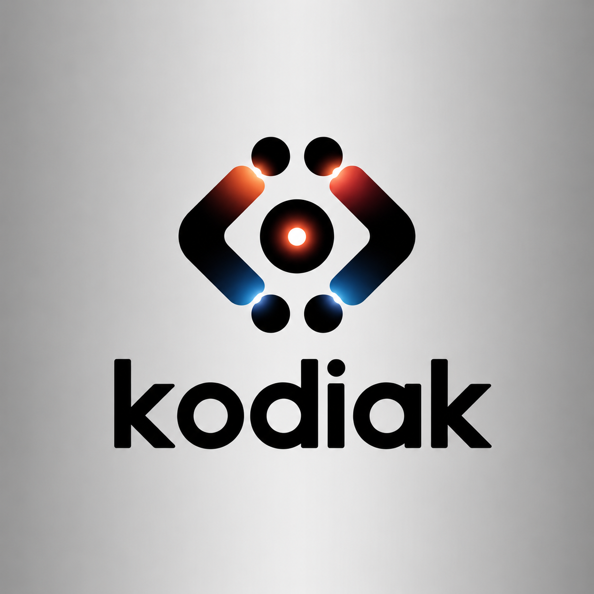

<div align="center">



# Kodiak

**An early-stage, approval-gated software engineering framework.**

[Quickstart](#quickstart) · [CLI](#cli-commands) · [Safety](#approval-and-git-safety) ·
[Architecture](#architecture) · [Limitations](#known-limitations)

</div>

## What Kodiak is

Kodiak is an open-source AI software engineering framework that uses specialized agents to analyze repositories, plan code changes, apply safe edits, run tests, review diffs, and manage task memory. It is designed to turn high-level software tasks into safer, test-backed code changes with explicit approval gates for risky operations.

## Current v1 status

The local v1 workflow is implemented for a deliberately narrow set of deterministic tasks. It works
on Windows PowerShell without internet access, Docker, or a paid LLM API key. It analyzes a target
directory, produces a structured plan, selects a known target, previews or applies one bounded edit,
runs local checks, reviews Git state, and records the result.

The broader LLM, RAG, database, worker, GitHub, and sandbox packages in this repository remain
experimental. They are not all connected to the local v1 task runner.

### Features that work

- `kodiak analyze analyze . --deep` repository analysis
- Deterministic task plans and file selection for the supported task types
- Idempotent README Quickstart updates
- Verified FastAPI `/health` test generation
- Source-safe `--dry-run` and commit-free `--no-commit` modes
- pytest, Ruff lint, and Ruff formatting checks with timeout and missing-tool reporting
- Read-only Git branch, status, changed-file, and diff-stat summaries
- File-backed approval creation, listing, approval, and rejection
- Sanitized JSONL task history and per-run JSON reports
- Local diagnostics and an inventory of the shipped agent implementations
- Clean manual fallback for unsupported tasks

## Installation

Prerequisites are Python 3.12 or newer and Git. Install the development tools to enable the task
runner's pytest and Ruff checks.

```powershell
git clone <your-kodiak-repository-url>
cd Kodiak
python -m venv .venv
.\.venv\Scripts\Activate.ps1
python -m pip install -e ".[dev]"
```

## Quickstart

<!-- kodiak-v1-quickstart -->

Kodiak's local v1 workflow needs Python 3.12 or newer. Provider API keys, Docker, and internet
access are not required for the commands below.

```powershell
python -m venv .venv
.\.venv\Scripts\Activate.ps1
python -m pip install -e ".[dev]"
kodiak --help
kodiak doctor
kodiak analyze analyze . --deep
kodiak task run "Improve the README quickstart section" --path . --dry-run
```

Use `--dry-run` to plan without source-file writes. Use `--no-commit` to apply a supported edit
without creating a commit. Kodiak v1 never pushes.

## CLI commands

```powershell
kodiak --help
kodiak doctor

kodiak analyze --help
kodiak analyze analyze . --deep

kodiak task --help
kodiak agents list

kodiak approval list --path .
kodiak approval approve <approval_id> --path .
kodiak approval reject <approval_id> --path .

kodiak memory history --path .
kodiak memory history --path . --limit 20

kodiak git diff-summary --path .
```

Normal path and storage errors are reported without a traceback. `approval approve` and
`approval reject` only update a decision record; they do not execute the requested action.

## Task runner

### README Quickstart improvement

Preview the exact patch without changing a source file:

```powershell
kodiak task run "Improve the README quickstart section" --path . --dry-run
```

Apply the idempotent edit, run checks, review Git state, and leave the working tree uncommitted:

```powershell
kodiak task run "Improve the README quickstart section" --path . --no-commit
```

The editor updates the first level-two `Quickstart` section and removes duplicate level-two
Quickstart sections. Repeating the task does not add another section.

### Health-check test

```powershell
kodiak task run "Add a simple health check test" --path . --dry-run
```

Kodiak scans for a FastAPI application and a `/health` route, then verifies the application import
in a separate bounded Python process. It proposes a test only when the import and registered route
are confirmed. In real mode it will not overwrite an unrelated existing test file.

### Unsupported instructions

Other instructions still receive an analysis and structured plan, but finish as `manual_required`.
Kodiak does not make a speculative edit or report false completion.

## Approval and Git safety

Approval requests are stored in `.kodiak/approvals.json` with an ID, task ID, action, reason, risk
level, status, timestamps, and sanitized metadata. Supported statuses are `pending`, `approved`, and
`rejected`.

The v1 policy requires approval before:

- Creating a commit or attempting any push
- Deleting files or editing more than five files
- Changing dependency or lock files
- Changing CI/CD workflows
- Changing authentication or security code
- Changing database migrations
- Running risky shell commands

The local task runner never pushes, force-resets, cleans, or performs a destructive checkout. Its Git
summary uses read-only Git commands with argument lists, a repository working directory,
`shell=False`, and timeouts. The default task mode can create a pending local-commit approval after a
successful edit, but v1 deliberately provides no command that executes that commit. Use
`--no-commit` when you want an edit without a commit approval.

## Memory and history

Every valid task run appends a compact record to `.kodiak/task_history.jsonl` and writes a detailed,
sanitized `.kodiak/runs/<task_id>.json` report. History includes the instruction, selected path,
mode, final status, changed files, check summaries, review summary, approval ID, and errors.

```powershell
kodiak memory history --path .
kodiak memory history --path . --limit 20
```

Malformed JSON and JSONL entries are ignored safely. Common secret fields and token patterns are
redacted before task data is persisted. Kodiak does not store environment-variable dumps or provider
key values.

## Doctor diagnostics

```powershell
kodiak doctor
kodiak doctor --json
```

Doctor reports the Python version, Kodiak and CLI imports, current directory, Git availability and
repository state, pytest, Ruff, optional Docker, `.kodiak` state, platform details, and whether these
optional provider variables are present:

- `OPENAI_API_KEY`
- `GROQ_API_KEY`
- `OPENROUTER_API_KEY`
- `ANTHROPIC_API_KEY`
- `GEMINI_API_KEY`

Only `present` or `missing` is printed; values are never displayed.

## Testing

The checked-in test suite does not require internet, Docker, or paid provider keys.

```powershell
ruff check .
ruff format --check .
python -m pytest -ra -vv --tb=short
```

The task runner invokes the equivalent pytest and Ruff commands in the selected repository. A missing
development tool is reported as unavailable; a real test or lint failure produces a non-success task
status and is not hidden.

## Architecture

The CLI is presentation-only. The deterministic local workflow lives in `TaskOrchestrator` and uses
separate components for repository inspection, planning, safe editing, checking, diff review,
approval policy, Git inspection, and local state.

```text
CLI instruction
  -> repository inspection
  -> deterministic plan and file selection
  -> safe edit proposal
  -> dry-run OR repository-contained write
  -> pytest and Ruff checks
  -> read-only Git review
  -> optional approval request
  -> sanitized task history and final report
```

`kodiak agents list` describes the existing `PlannerAgent`, `RepositoryAgent`, `CoderAgent`,
`TesterAgent`, `ReviewerAgent`, `GitAgent`, and `MemoryAgent` modules and whether their principal
behavior is deterministic or LLM-backed. Those advanced implementations are an inventory, not a
claim that every one participates in the deterministic local runner.

### Local API

The FastAPI application exposes the same deterministic task service used by the CLI. Start it only
on a trusted local interface because v1 accepts a local repository path and does not yet add
repository-scoped API authentication.

```powershell
python -m uvicorn kodiak.api.main:app --host 127.0.0.1 --port 8000
```

Working local routes include `GET /health`, `GET /agents`, `POST /tasks/run`,
`GET /tasks/{task_id}`, `GET /approvals`, approval/rejection actions, and
`GET /memory/history`. The task, approval, and history routes accept a repository path; task runs
are persisted under that repository's `.kodiak` directory. The separate database-backed project
API remains experimental.

Example dry run:

```powershell
Invoke-RestMethod -Method Post -Uri http://127.0.0.1:8000/tasks/run `
  -ContentType 'application/json' `
  -Body '{"instruction":"Improve the README quickstart section","path":".","dry_run":true}'
```

## Local storage

```text
.kodiak/
|-- approvals.json
|-- task_history.jsonl
|-- pytest_cache/
`-- runs/
    `-- <task_id>.json
```

All v1 state is rooted beneath the repository path passed to the command. Source edits are resolved
and checked against that root before writing. `.kodiak/` is ignored by this repository's Git config.

## Known limitations

- Automatic editing supports only README Quickstart updates and verified FastAPI health tests.
- The deterministic runner does not generate arbitrary patches from an LLM.
- Approval records decisions but does not resume a task or execute a commit.
- The local-path API is intended for a trusted loopback environment and is not authenticated in v1.
- Checks run in the current Python environment, not in an isolated Docker sandbox.
- The v1 workflow does not create branches, commits, pushes, pull requests, or GitHub issues.
- Existing unrelated working-tree changes are included in the Git summary; review the final diff.
- The experimental database, worker, RAG, GitHub, and advanced-agent paths have separate maturity and
  configuration requirements.

## Recommended v2 roadmap

- Resume an approved action with hash and repository revalidation
- Add rollback for a bounded edit when a required check fails
- Connect validated LLM-generated patches to the same path and approval policies
- Add isolated test execution with explicit resource and network controls
- Add diff ownership tracking that separates pre-existing changes from task changes
- Add authenticated, repository-scoped API execution for the local orchestrator
- Add branch and pull-request workflows only after explicit approval and security review

## Contributing

Read [CONTRIBUTING.md](CONTRIBUTING.md) and run the three verification commands before submitting a
change. Do not include credentials or `.kodiak/` runtime state in a contribution.

## License

Kodiak is available under the [MIT License](LICENSE).
