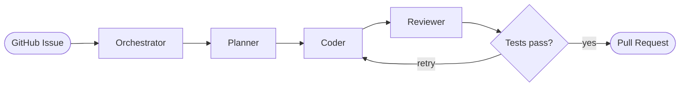

<div align="center">

<picture>
  <source media="(prefers-color-scheme: dark)" srcset="images/kodiaklogo.png">
  
</picture>

<br/><br/>

# kodiak

**Autonomous AI software engineer.**<br/>
Give it a GitHub issue. It plans, codes, tests, and opens a PR.

<br/>

[](https://github.com/your-org/kodiak/actions/workflows/ci.yml)
[](https://python.org)
[](https://fastapi.tiangolo.com)
[](https://langchain-ai.github.io/langgraph/)
[](LICENSE)
[](https://github.com/your-org/kodiak/stargazers)
[](https://discord.gg/your-invite)

<br/>

[Overview](#overview) &nbsp;&middot;&nbsp;
[Quickstart](#quickstart) &nbsp;&middot;&nbsp;
[Architecture](#architecture) &nbsp;&middot;&nbsp;
[Stack](#stack) &nbsp;&middot;&nbsp;
[Development](#development) &nbsp;&middot;&nbsp;
[Docs](ARCHITECTURE.md)

<br/>

</div>

---

## Overview

Kodiak is a self-contained autonomous software engineering agent. Install it as a GitHub App, and it handles the entire development cycle without human intervention.

When an issue is opened, Kodiak reads it, searches your codebase for relevant context, writes a structured implementation plan, generates the code, self-reviews the diff, runs your test suite inside an isolated Docker container, and opens a pull request — complete with tests and a written explanation of every decision it made.

No prompt engineering per repository. No branch to create. No tests to run manually. No PR to open.

<br/>

<table>
<tr>
<td align="center" width="33%">
<strong>Fully Autonomous</strong><br/><br/>
Issue to merged PR with no human step in between. Kodiak manages the branch, writes the code, runs the tests, and opens the PR.
</td>
<td align="center" width="33%">
<strong>Codebase-Aware</strong><br/><br/>
Semantic search across your full repository before writing a single line. Plans are grounded in your actual code, not invented from scratch.
</td>
<td align="center" width="33%">
<strong>Self-Validating</strong><br/><br/>
Runs your real test suite in an isolated sandbox. If tests fail, the coder retries with the failure output as additional context.
</td>
</tr>
</table>

---

## Why Kodiak

| Capability | GitHub Copilot | ChatGPT | Kodiak |
|---|:---:|:---:|:---:|
| Reads and understands GitHub issues | — | Yes | Yes |
| Searches your codebase for context | — | — | Yes |
| Produces a structured implementation plan | — | Partial | Yes |
| Generates code | Yes | Yes | Yes |
| Self-reviews its own output | — | — | Yes |
| Runs your real test suite to validate | — | — | Yes |
| Opens a pull request autonomously | — | — | Yes |
| Requires a human in the loop | Yes | Yes | **No** |

---

## Demo

```
$ # Issue #142: "Add rate limiting to /api/v1/auth/login"

[kodiak]  Reading issue #142...
[kodiak]  Searching codebase — 847 chunks across 203 files indexed
[kodiak]  Plan ready: 4 files · 2 new · 2 modified

[kodiak]  Writing  src/api/middleware/rate_limit.py     new       89 lines
[kodiak]  Writing  src/api/routes/auth.py               modified  +12 lines
[kodiak]  Writing  tests/unit/test_rate_limit.py        new       61 lines
[kodiak]  Writing  config/settings.py                   modified  +4 lines

[kodiak]  Self-review complete — all issue requirements met
[kodiak]  Running test suite in isolated sandbox...
[kodiak]  47 passed · 0 failed · 0 errors · 12.3s

[kodiak]  Opening PR #143...

  PR opened  feat: add rate limiting to auth login endpoint (#142)
             4 files changed · +166 · -3 · elapsed 4m 12s
```

Every PR includes a decision log documenting which files were changed, why each choice was made, and the test result. See [Decision Log](#decision-log).

---

## Quickstart

**Prerequisites:** Python 3.12 &nbsp;&middot;&nbsp; Docker &nbsp;&middot;&nbsp; [`uv`](https://docs.astral.sh/uv/)

**1 &mdash; Install**

```bash
git clone https://github.com/your-org/kodiak
cd kodiak
uv sync --all-extras
```

**2 &mdash; Configure**

```bash
cp .env.example .env
```

> [!IMPORTANT]
> Open `.env` and fill in `SECRET_KEY`, `ANTHROPIC_API_KEY`, and all `GITHUB_APP_*` values. Kodiak will not start without them. See [Environment Variables](#environment-variables) for the full reference.

**3 &mdash; Start**

```bash
make up           # Start Postgres 16, Redis 7, ChromaDB
make db-migrate   # Apply Alembic migrations
make dev          # API on :8080
```

> [!TIP]
> Run `make worker` in a second terminal to process GitHub events asynchronously via Celery.

API at `http://localhost:8080` &nbsp;&middot;&nbsp; Interactive docs at `http://localhost:8080/docs`

---

## How It Works

An issue opens. The GitHub App webhook fires. A LangGraph state machine takes over and does not stop until there is a pull request.



Each step produces structured output consumed by the next. If the Tester fails, the Coder receives the failure output as additional context and retries — up to `MAX_RETRIES` attempts before the run is marked failed and left for human review.

---

## Architecture


Every agent emits OpenTelemetry spans. Every decision is persisted to PostgreSQL and written into the PR body.

### Agent Pipeline

| Agent | Input | Output | Tools |
|---|---|---|---|
| **Orchestrator** | GitHub issue payload | Routed LangGraph task graph | Redis, PostgreSQL, LangGraph |
| **Planner** | Issue text + repository tree | Structured diff plan (JSON) | ChromaDB RAG, LLM |
| **Coder** | Diff plan + current file contents | Modified and new files | LLM, Docker |
| **Reviewer** | Original issue + generated diff | Approval or revision notes | LLM |
| **Tester** | Modified files | Pass / fail result + logs | Docker sandbox |

### Decision Log

Every PR Kodiak opens includes a machine-generated log describing the reasoning behind every change:

```markdown
### Kodiak · Run a4f8c2

Issue #142  ·  2026-01-15 14:23 UTC  ·  4m 12s elapsed

**Files changed**

src/api/middleware/rate_limit.py (new)
  Implemented sliding window counter using Redis. Chose Redis over in-memory
  storage to support multi-instance deployment without shared state.

src/api/routes/auth.py (modified)
  Applied RateLimitMiddleware decorator. Added 429 response to OpenAPI schema.

tests/unit/test_rate_limit.py (new)
  12 test cases covering normal flow, burst limiting, and Redis failure fallback.

config/settings.py (modified)
  Added RATE_LIMIT_REQUESTS and RATE_LIMIT_WINDOW with defaults of 100 req / 60s.

**Review**
All requirements from issue #142 met. Redis is an existing stack dependency;
no new infrastructure required.

**Result**  47 passed · 0 failed · 12.3s
```

---

## Stack

| Layer | Technology | Reason |
|---|---|---|
| API | FastAPI + Uvicorn | Async-native, auto-typed, fast |
| Orchestration | LangGraph | Stateful agent graphs with built-in checkpointing |
| Database | PostgreSQL 16 + SQLAlchemy 2 | Durable run state, async I/O |
| Cache / Queue | Redis 7 + Celery | Low-latency task dispatch |
| Vector Store | ChromaDB | Codebase semantic search |
| Embeddings | sentence-transformers | Local inference, no API cost |
| LLM | Anthropic Claude · OpenAI GPT-4o | Swappable via unified router |
| Sandbox | Docker (rootless) | Safe, isolated, reproducible execution |
| Observability | OpenTelemetry + Prometheus + structlog | Full pipeline tracing |
| Migrations | Alembic | Schema versioning |

---

## Development

```bash
make test                              # Full test suite
make check                             # Ruff lint + mypy typecheck
make worker                            # Start Celery agent worker
make db-revision MSG="add indexes"     # New Alembic migration
```

### Testing

```bash
make test-unit         # Fast — no infrastructure required
make test-integration  # Requires running infra (make up)
make test-ci           # Spin up infra, run suite, tear down
```

<details>
<summary><strong>Project structure</strong></summary>

<br/>

```
kodiak/
├── api/
│   ├── routes/            # Endpoint handlers
│   └── middleware/        # Auth, rate limiting, logging
├── agents/
│   ├── planner.py         # RAG retrieval + LLM planning
│   ├── coder.py           # File-level code generation
│   ├── reviewer.py        # Diff self-critique
│   └── tester.py          # Sandbox test runner
├── orchestrator/          # LangGraph graph definition
├── memory/                # ChromaDB RAG + PostgreSQL state
├── sandbox/               # Docker execution layer
├── integrations/          # GitHub App webhook handlers
├── migrations/            # Alembic migration files
└── tests/
    ├── unit/
    └── integration/
```

</details>

---

## Environment Variables

<details>
<summary><strong>View all variables</strong></summary>

<br/>

| Variable | Required | Description |
|---|:---:|---|
| `SECRET_KEY` | Yes | App secret — `openssl rand -hex 32` |
| `ANTHROPIC_API_KEY` | Yes | Claude API key |
| `OPENAI_API_KEY` | No | GPT-4o key (optional if using Claude only) |
| `GITHUB_APP_ID` | Yes | Your GitHub App numeric ID |
| `GITHUB_APP_PRIVATE_KEY` | Yes | Path to downloaded `.pem` file |
| `GITHUB_WEBHOOK_SECRET` | Yes | Webhook secret from GitHub App settings |
| `DATABASE_URL` | Yes | Postgres connection string |
| `REDIS_URL` | Yes | Redis connection string |
| `CHROMA_HOST` | No | ChromaDB host (default: `localhost`) |
| `CHROMA_PORT` | No | ChromaDB port (default: `8000`) |
| `LLM_PROVIDER` | No | `anthropic` or `openai` (default: `anthropic`) |
| `MAX_RETRIES` | No | Max coder retry attempts per run (default: `3`) |
| `LOG_LEVEL` | No | `DEBUG`, `INFO`, `WARNING` (default: `INFO`) |

Full reference with defaults and descriptions: [.env.example](.env.example)

</details>

---

## GitHub App Setup

1. Create an app at [github.com/settings/apps/new](https://github.com/settings/apps/new)

2. Set the webhook URL:
   ```
   https://your-domain/api/v1/github/webhook
   ```

3. Grant the following permissions:

   | Permission | Level | Reason |
   |---|---|---|
   | Issues | Read | Receive `issue.opened` events |
   | Pull requests | Write | Open PRs on your behalf |
   | Contents | Write | Push generated code to branches |

4. Download the private key and set `GITHUB_APP_PRIVATE_KEY` in `.env`

5. Install the app on your target repositories

> [!NOTE]
> For local development, use [smee.io](https://smee.io) or [ngrok](https://ngrok.com) to forward GitHub webhook events to `localhost:8080`.

---

## Roadmap

- [x] GitHub issue to PR autonomous pipeline
- [x] LangGraph orchestration with full checkpointing
- [x] Rootless Docker sandbox
- [x] RAG-powered codebase search
- [x] OpenTelemetry tracing across all agents
- [ ] Multi-repository support
- [ ] Slack and Linear as issue sources
- [ ] Web UI for run inspection and step replay
- [ ] Self-hosted model support (Ollama, vLLM, DeepSeek)
- [ ] Fine-tuned reviewer model trained on merged PRs
- [ ] Auto-labeling and issue triage agent

---

## Contributing

Read [CONTRIBUTING.md](CONTRIBUTING.md) before opening a PR. Kodiak will review it before a human does.

```bash
git checkout -b feat/your-feature
make check && make test
git push origin feat/your-feature
```

Good first issues are labeled [`good first issue`](https://github.com/your-org/kodiak/labels/good%20first%20issue).  
Architecture discussion lives in [`discussions`](https://github.com/your-org/kodiak/discussions).

---

## License

MIT &mdash; see [LICENSE](LICENSE).

---

<div align="center">

<picture>
  <source media="(prefers-color-scheme: dark)" srcset="Kodiak_logo_transparent.png">
  
</picture>

<br/><br/>

<sub>Built with obsession &nbsp;&middot;&nbsp; Powered by Claude &nbsp;&middot;&nbsp; Reviewed by itself</sub>

</div>
